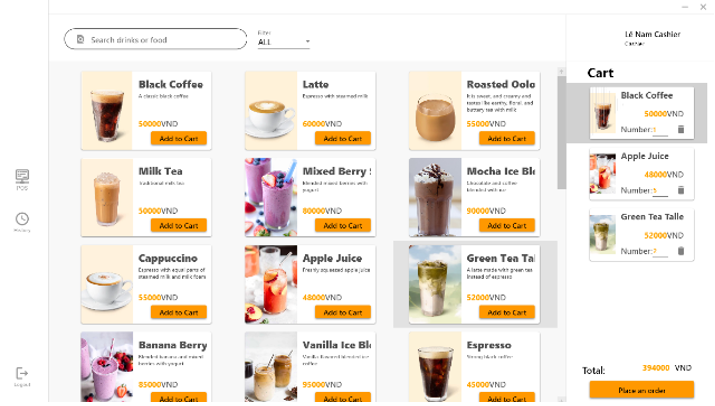

# Coffee Shop Management Software

## Description

This is a Windows-based desktop application developed using **C#**, **WPF**, and **SQL** to streamline the management of a coffee shop. The **Coffee Shop Management Software** provides a user-friendly interface for admins, cashiers, and staff to handle various operations such as menu management, order processing, employee management, billing, and revenue tracking. The application is designed to enhance efficiency, reduce errors, and improve the overall customer experience in a coffee shop environment.

---

## Related Repositories

This project is a standalone application developed as part of a university assignment. The source code and related assets can be found in the project's repository:

- **Source Code:** [Coffee Shop Management Software](https://github.com/TuananhDo0308/coffee-shop-management.git) *(Placeholder link, replace with actual repository if available)*

---

## Preview

### 1. Application UI


#### Menu Management (Admin)


#### Employee Management (Admin)


#### Revenue Statistics (Admin)


#### Order Processing (Cashier)



#### Bartender View (Bartender)


---

### Features

- **User Authentication:** Secure login for admins, cashiers, and staff with role-based access control.
- **Menu Management:** Add, edit, delete, and categorize products (e.g., coffee, juice).
- **Order Management:** Create, modify, and process orders with real-time updates on total cost.
- **Billing System:** Generate and view bills, including detailed order information.
- **Employee Management:** Manage employee accounts, assign roles, and update information.
- **Revenue Tracking:** Generate reports on revenue, product sales, and performance metrics.
- **Responsive UI:** Built with WPF for a modern, intuitive, and user-friendly interface.

---

## Table of Contents

- [Getting Started](#getting-started)
- [Prerequisites](#prerequisites)
- [Installation](#installation)
- [Configuration](#configuration)
- [Run the Project](#run-the-project)
- [Usage](#usage)
- [Tech Stack](#tech-stack)
- [License](#license)

---

## Getting Started

Follow these steps to set up and run the project locally.

---

## Prerequisites

Ensure you have the following installed on your system:

- **.NET Framework:** Version 4.5 or higher.
- **Visual Studio:** 2019 or later (Community, Professional, or Enterprise) for development and debugging.
- **SQL Server:** For database management (e.g., SQL Server Express).
- **Git:** For cloning the repository (optional).

---

## Installation

1. Clone the repository to your local machine (if available):

   ```bash
   git clone https://github.com/TuananhDo0308/coffee-shop-management.git
   cd coffee-shop-management
   ```

2. Open the project in Visual Studio:

   - Launch **Visual Studio**.
   - Open the `.sln` (solution) file from the cloned repository.

3. Restore dependencies:

   - In Visual Studio, go to **Tools > NuGet Package Manager > Manage NuGet Packages for Solution**.
   - Install required packages, such as **Entity Framework** for database operations.

4. Set up the SQL Server database:

   - Create a new database in **SQL Server Management Studio** (e.g., `CoffeeShopDB`).
   - Update the database connection string in the project’s configuration file (e.g., `App.config` or `web.config`).

---

## Configuration

1. Configure the database connection:

   - Open the configuration file (e.g., `App.config`) in Visual Studio.
   - Update the connection string to point to your SQL Server instance. Example:

     ```xml
     <connectionStrings>
       <add name="CoffeeShopDB" connectionString="Server=localhost;Database=CoffeeShopDB;Trusted_Connection=True;" providerName="System.Data.SqlClient" />
     </connectionStrings>
     ```

2. Initialize the database:

   - Run the SQL scripts (if provided in the repository) to create tables for `MENU`, `BILL`, `BILLDETAIL`, `EMPLOYEE`, and `TYPE`.
   - Alternatively, use **Entity Framework** migrations to set up the database schema:
     ```bash
     Update-Database
     ```

3. Verify project settings:

   - Ensure the project targets the correct .NET Framework version.
   - Set the startup project to the main application (e.g., `CoffeeShopManagement.WPF`).

---

## Run the Project

### Development

1. Open the project in Visual Studio.
2. Press **F5** or click **Start** to build and run the application in debug mode.
3. The login screen will appear, allowing you to test the application with predefined credentials (e.g., admin, cashier, or staff accounts).

### Build and Deploy

1. Build the project:
   - Go to **Build > Build Solution** in Visual Studio.
   - Ensure no errors are reported.

2. Publish the application:
   - Right-click the project in **Solution Explorer** and select **Publish**.
   - Choose a publish target (e.g., Folder) and follow the wizard to generate an executable.

3. Run the executable:
   - Navigate to the publish folder and double-click the `.exe` file to launch the application.

---

## Usage

Once the application is running, users can:

- **Log in** as an admin, cashier, or staff member using their credentials.
- **Admins** can:
  - Manage the menu (add, edit, delete products).
  - Manage employee accounts and assign roles.
  - View revenue statistics and sales reports.
- **Cashiers** can:
  - Create and process customer orders by adding products to the cart.
  - Generate bills and view order details.
- **Staff** can:
  - View and confirm orders, marking them as completed.
- Use the intuitive UI to navigate between features like menu management, order processing, and billing.

---

## Tech Stack

The project uses the following technologies:

- **C#:** Primary programming language for application logic.
- **WPF (Windows Presentation Foundation):** For building a modern, responsive desktop UI.
- **MVVM (Model-View-ViewModel):** Architectural pattern for separating UI, logic, and data.
- **Entity Framework:** ORM for database operations with SQL Server.
- **SQL Server:** Relational database for storing menu, orders, employees, and billing data.
- **XAML:** For designing the UI in WPF.

---

## License

This project is licensed under the [MIT License](LICENSE).

---

## Acknowledgments

- **Instructor:** Trần Thanh Nhã, for guidance and support during the project.
- **Team Members:**
  - Đỗ Trần Tuấn Anh: Designed and coded login, sales, menu management, employee management, order processing, and SQL database; presented the project.
  - Trần Quốc Ấn: Coded revenue statistics and history interfaces, recorded demo, designed SQL database, sourced images, and presented.
  - Trịnh Quang Minh: Prepared the project report.
  - Trần Quốc Long: Edited SQL database, populated data, and created PowerPoint slides.
- **References:**
  - [HowKteam: WPF - MVVM Inventory Management Software](https://www.howkteam.com) *(2018)*

---

## Future Development

To enhance the application, the following features could be added:

- **Online Ordering:** Integrate a web or mobile interface for customers to place orders remotely.
- **Inventory Management:** Track stock levels for ingredients and supplies.
- **Mobile App:** Develop a companion app for customers and staff to improve accessibility.
- **Advanced Analytics:** Implement more detailed sales and performance reports.

---

This **Coffee Shop Management Software** is a robust solution for coffee shop owners looking to streamline operations and improve efficiency. Happy managing! ☕